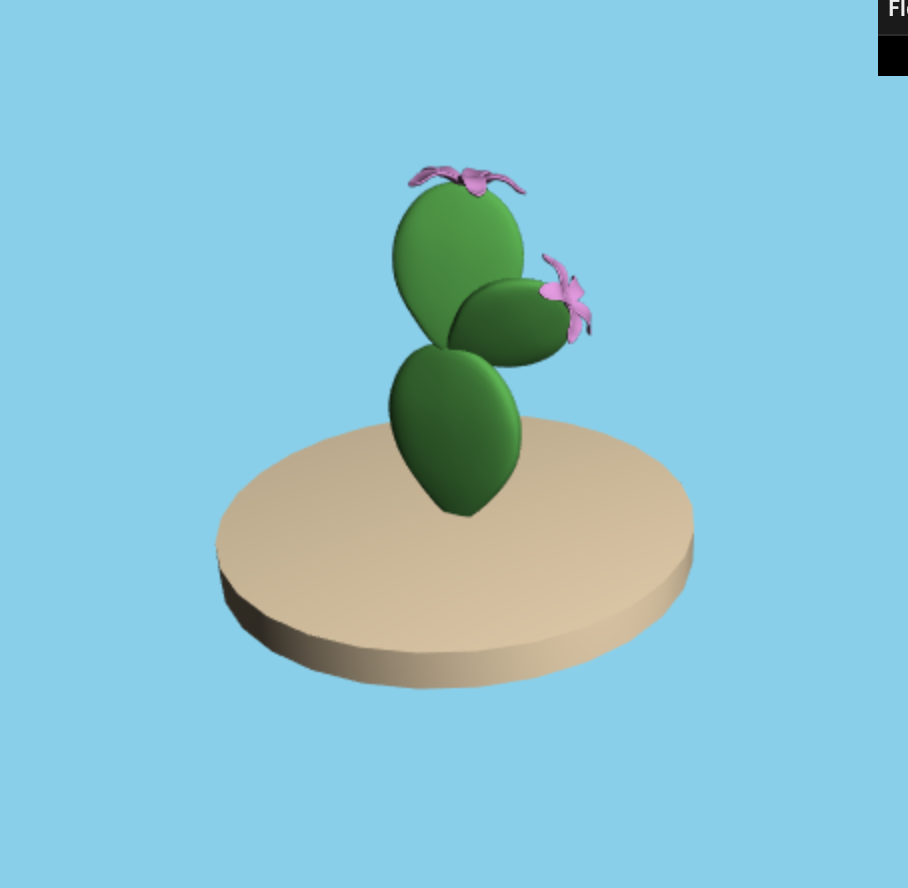
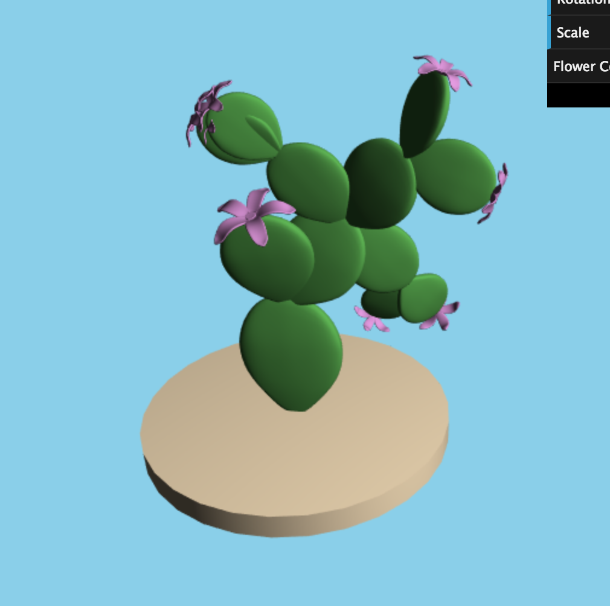
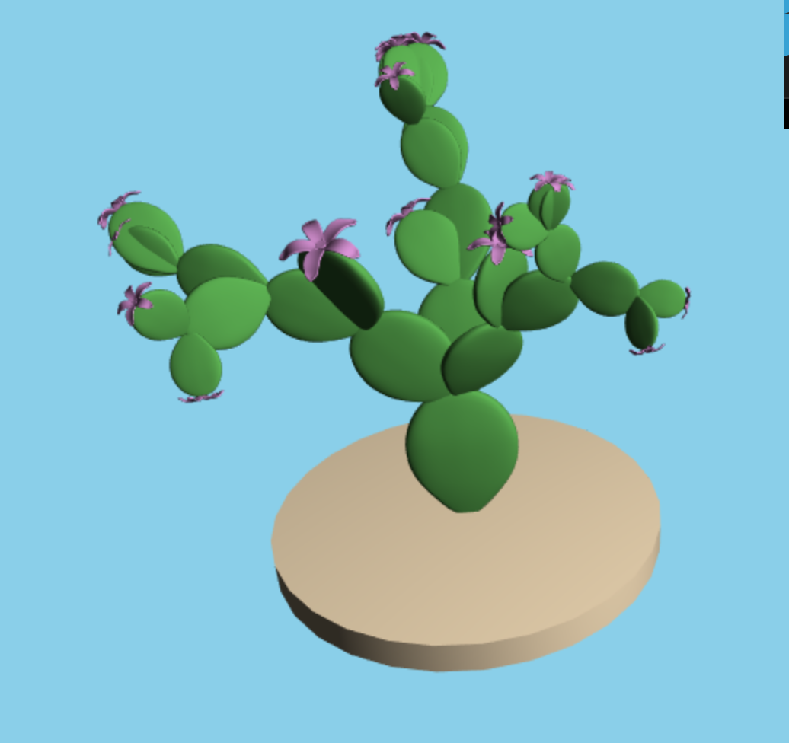
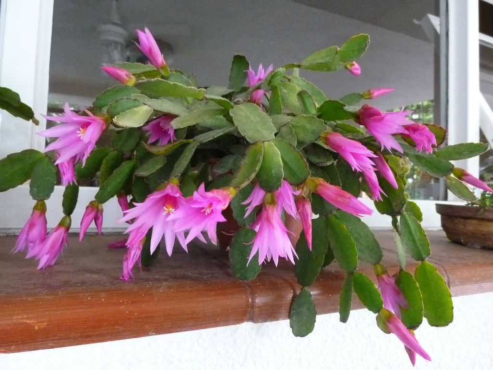

# Homework 4: L-systems

## Caroline Lachanski's (clach) Results
I wanted to make a cactus-like L-system (see reference images at end). I modelled a cactus paddle to be my basic branch, and then a paddle with a flower at the top to be a leaf (I also modelled a cylinder base). The user can control the number of iterations (string expansions), the rotation of the plant (how much each paddle rotates), the scale of the paddles), and the color of the flowers. Once given a seed string ('0'), the string is expanded a number of times (based on the number of iterations). It then figures out which drawing functions to call, and calls them using the Turtle (drawing functions belong to the Turtle, who keeps track of position, orientation, etc). I experimented with during string expansion rules and drawing rules until I found something that I think best resembled the reference images at various iterations. 

Iteration 0:
[]

Iteration 1:
[]

Iteration 2:
[]

Iteration 3:
[]

Iteration 4:
[]

Reference links:
https://github.com/YuqinShao/WebGL-Obj-Loader/blob/master/webgl-obj-loader.js (for OBJ loader)
https://stackoverflow.com/questions/14446447/how-to-read-a-local-text-file (for reading in OBJ files)

Reference images:

[]

[]

[]

